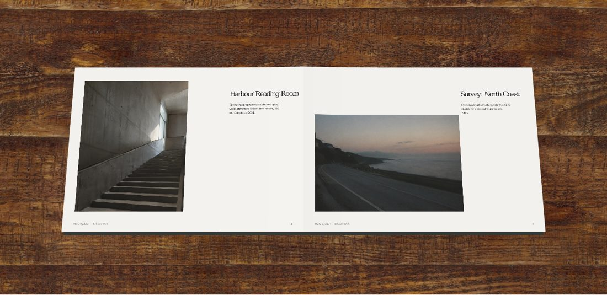
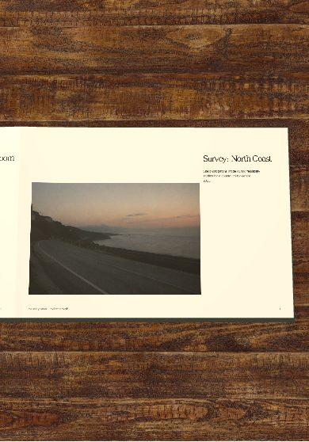

# Unpublished flipbook preview

This change is prepared on `codex/flipbook-studio-preview`. It has not been
merged into Lovable's connected `main` branch or deployed.

## Reading experience

- Simple and Studio use the same persistent Three.js book scene.
- Studio adds paper relief, finish, page thickness, directional lighting and
  real shadows. Choose matte, satin, textured or natural paper; soft, bright
  or warm lighting; direction and brightness; and photographic wood/stone
  backdrops. These choices only affect the current viewer session.
- The same physical spreads are used at every width. Below 720 px, the camera
  frames the active page. Reading the second page of an already-open spread
  pans the camera; crossing to a new spread turns the sheet and follows it.
- Corner cues fold into view near the book's lower corners, disappear before
  a turn starts, and are hidden on phones. Buttons, keyboard and swipes work.
- The homepage loop has front and reverse faces, so it opens into a visible
  two-page spread, closes to one page, and plays in reverse.
- WebGL-unavailable devices retain a flat PDF reader. Reduced motion works.





## Run and check

Use the repository's Bun lockfile for a reproducible installation. The working
preview was checked with Node 24/npm because Bun was unavailable here:

```sh
bun install --frozen-lockfile
bun run dev -- --host 127.0.0.1 --port 5173
```

Open `/p/sample?demo=book` to test with bundled demonstration content.

Checks passed: production build, `tsc --noEmit`, focused ESLint for the new
renderer/controller/layout/homepage components, and three layout regression
checks (`node --experimental-strip-types --test tests/book-layout.test.ts`).
A Chromium browser check covered desktop forward/backward turns, Studio
controls, corner-cue timing, phone camera movement, and reduced motion with no
uncaught runtime errors. Existing project-wide formatting warnings remain.

Renderer: `src/lib/portfolia/book-scene.ts`.
Controller: `src/components/pf/BookView.tsx`.
Layout rules: `src/lib/portfolia/book-layout.ts`.
Backdrop license/source details: `public/studio/README.md`.
